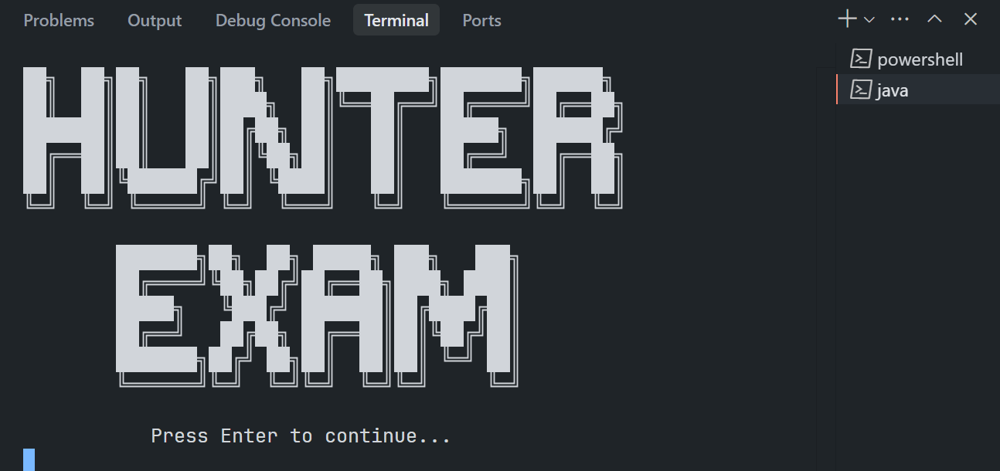

## 📁 Files

* **`_Phase1.java`**: (Ashton)
* **`_Phase2.java`**: (Tachi)
* **`_Phase3.java`**: (JR)
* **`_Phase4.java`**: (sir Rey)
* **`_PhaseFinal.java`**: (Meynard)

<details>
  <summary>Files for connecting everything:</summary>
  
* **`_Intro.java`** 
* **`Main.java`**
* **`UI.java`**

</details>

<details>
  <summary>Files just for testing our SQL database:</summary>
  
* **`SQL.java`**
* **`mysql-connector-j-9.3.0.jar`**

</details>

---

## ⬇️ Download
<details>
  <summary>WINDOWS [VS Code or other]</summary>


* Enter this code
    ```bash
    git clone https://github.com/IMOitself/hunterexam.git
    ```
  
</details>

<details>
  <summary>ANDROID [Termux]</summary>
  
* Download Termux
    [download link](https://f-droid.org/repo/com.termux_1021.apk)
* Enter this code
    ```bash
    pkg update && pkg upgrade -y
    pkg install git -y
    termux-setup-storage
    cd ~/storage/downloads
    git clone https://github.com/IMOitself/hunterexam.git
    ```
</details>

## ▶️ How to Run

once downloaded, on your Terminal (VS Code or Termux or other IDE):

### Run `Main.java`

* 
    ```bash
    javac -d classes *.java
    java -cp classes Main
    ```

### or Run `SQL.java`

* 
   ```bash
   javac -cp ".;mysql-connector-j-9.3.0.jar" SQL.java
   java -cp ".;mysql-connector-j-9.3.0.jar" SQL 
   ```
