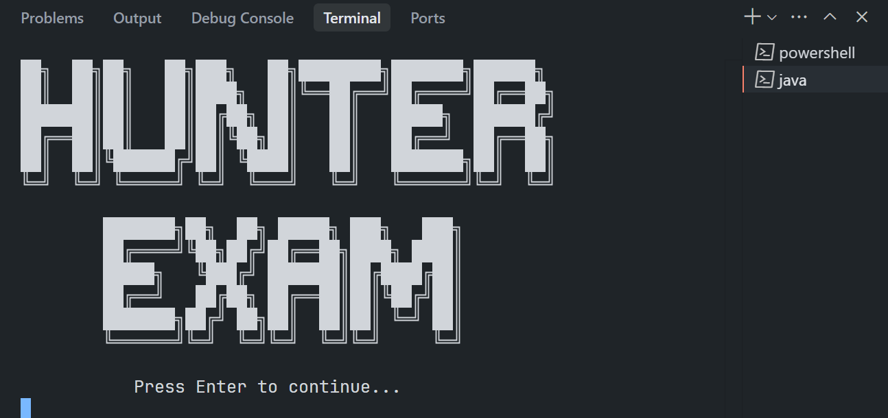
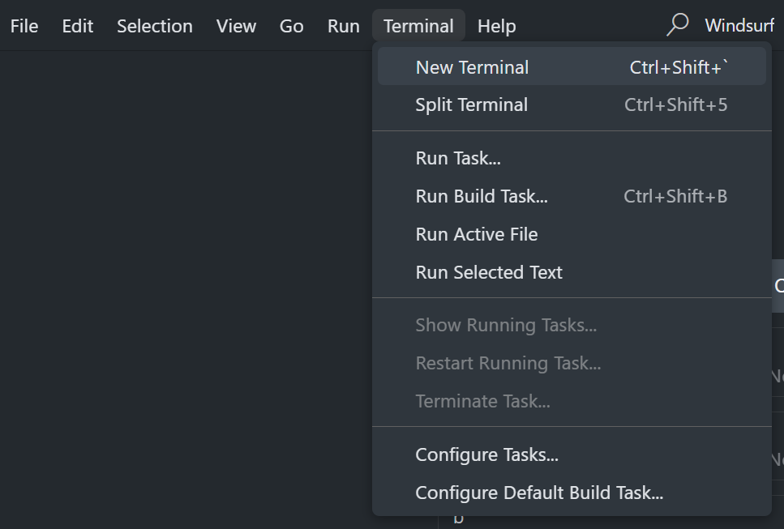
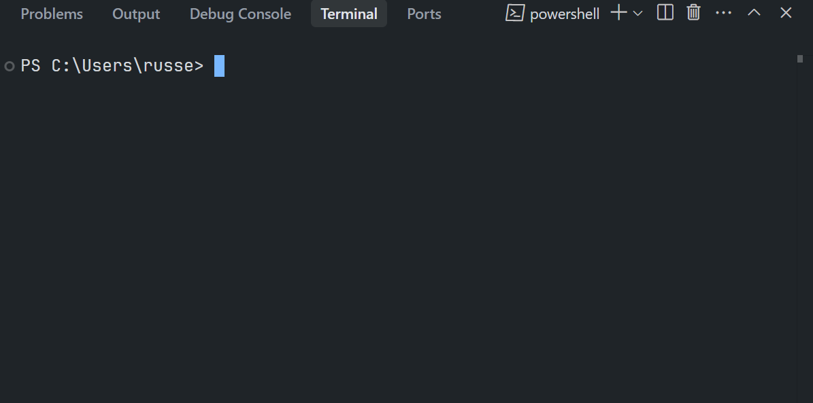

## 📁 Files

* **`_Phase1.java`**: (Ashton)
* **`_Phase2.java`**: (Tachi)
* **`_Phase3.java`**: (JR)
* **`_Phase4.java`**: (sir Rey)
* **`_PhaseFinal.java`**: (Meynard)

<details>
  <summary>Files for connecting everything:</summary>
  
* **`_Intro.java`** 
* **`Main.java`**
* **`UI.java`**

</details>

<details>
  <summary>Files just for testing our SQL database:</summary>
  
* **`SQL.java`**
* **`mysql-connector-j-9.3.0.jar`**

</details>

## 

<div align="center">

## ⬇️ Download
</div>

<details>
  <summary> 
    💻 WINDOWS</summary>

  * Download Git and run it
    [download link](https://github.com/git-for-windows/git/releases/download/v2.49.0.windows.1/Git-2.49.0-64-bit.exe)
  * Download OpenJDK and run it
    [download link](https://download.oracle.com/java/24/latest/jdk-24_windows-x64_bin.exe)
  * On your coding software e.g VS Code or other
  * 
  * 
* Enter this code
    ```bash
    git clone https://github.com/IMOitself/hunterexam.git
    cd hunterexam/
    ```
  
</details>

<details>
  <summary>📱 ANDROID</summary>
  
* Download Termux
    [download link](https://f-droid.org/repo/com.termux_1021.apk)
* Enter this code
    ```bash
    pkg update && pkg upgrade -y
    pkg install git openjdk-17 -y
    git --version
    java -version
    javac -version
    termux-setup-storage
    cd ~/storage/downloads
    git clone https://github.com/IMOitself/hunterexam.git
    cd hunterexam/
    ```
</details>

<div align="center">

## ▶️ How to Run
</div>

**Run `Main.java`**

* 
    ```bash
    javac -d classes *.java
    java -cp classes Main
    ```

**or Run `SQL.java`**

* 
   ```bash
   javac -d classes SQL.java
   java -cp classes:mysql-connector-j-9.3.0.jar SQL
   ```

---

**❗ Note:** run the `Main.java` or `SQL.java` on the same Terminal where u downloaded the files.
